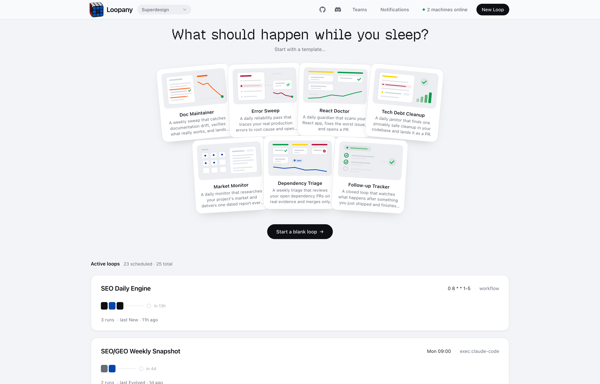
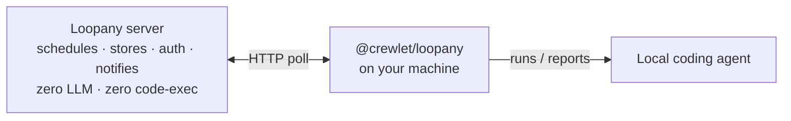

<div align="center">


# Loopany

**Scheduled agent loops. Keep the system under control.**

Describe a recurring task once. Loopany runs it on a schedule with **your own machine's coding agent**, and surfaces every result on a shared dashboard and your team's notification channel.

[](https://www.npmjs.com/package/@crewlet/loopany)
[](LICENSE)
[](https://github.com/superdesigndev/loopany-platform/stargazers)
[](https://github.com/superdesigndev/loopany-platform/actions/workflows/deploy.yml)

[Website](https://loopany.ai) · [npm](https://www.npmjs.com/package/@crewlet/loopany) · [Contributing](CONTRIBUTING.md) · [Architecture](AGENTS.md)

</div>

## What is Loopany?

Loopany is infrastructure for **recurring agent work**. You describe a loop - a daily health check, a weekly research digest, a closed goal like "follow up until it's fixed". A small daemon on a machine you control runs it on schedule using your local coding agent.

<p align="center">
  
</p>

The server only schedules, stores, authenticates, and notifies. **It never runs an LLM and never executes your code.** Execution is BYOA: [`@crewlet/loopany`](https://www.npmjs.com/package/@crewlet/loopany) on *your* machine, with *your* credentials, files, and tools. Artifacts you choose to sync come back as durable content; the rest never leaves the box.

A loop can stay **open** (a monitor or digest that runs indefinitely) or **closed** (a finish line: the loop completes itself when the goal is met).

Most coding agents can already run on a cron or loop a task themselves. That is the easy 5% - the timer. The real work is the structure that lets you trust it and run reliably. A bare agent loop does not give you:

- **Durable structure across runs** - state and logs so it never re-does work and gets smarter over time; a verifier so there is evidence, not vibes; a contract and boundary that decide whether you can safely walk away. A raw cron loop has none of this by default.
- **Self-improving (evolve)** - a periodic pass that rewrites the loop itself (tighter contract, cheaper trigger, mechanical steps folded into scripts), so it gets sharper and cheaper the longer it runs. A DIY loop stays as dumb as day one.
- **A team surface, not a terminal** - a shared dashboard, per-team notification channels, and failure alerts. Results show up where your team can see them, instead of scrolling a local terminal.
- **BYOA + vendor-neutral** - runs on *your* machine with *your* agent and credentials; not locked to one vendor's agent. Switch agents without rebuilding.
- **A safe, cheap control plane** - the server runs zero LLM and executes zero code; it only schedules, stores, authenticates, and notifies. You are not handing your code or secrets to a SaaS just to get scheduling.

## Features

- **Scheduled agent loops** - cron or one-shot; open monitors or closed goals that finish themselves when met.
- **BYOA execution** - runs on your machine via `@crewlet/loopany`; the server is zero-LLM and zero code-exec. Credentials and tools stay local.
- **Self-improving loops** - evolve passes review run history, sharpen the brief, distill state, and refine the generative dashboard.
- **Deterministic pre-stage** - optional workflow body for cheap mechanical work before the agent; failures fall back to the agent with context.
- **Teams + notifications** - multi-user dashboard, per-team push channels (Telegram, Feishu, and more), failure alerts.
- **Synced artifact home** - loop folder in, dashboard out; front-matter products (reports, kanban cards, calendars) render as generative UI.
- **Templates** - React Doctor, Market Research, Follow-up Tracker, Docs Sweep, Housekeeper, Dependency Triage, Error Sweep.
- **Self-hostable** - one process, embedded pglite by default for local, Postgres + object store for production; Docker image included.

## Quickstart (connect to a server)

**Hosted app:** sign in at **[https://loopany.ai](https://loopany.ai)** (or use your own self-hosted instance). You will also, for now, need at least one machine you control to run loops.

1. **Sign in** to the Loopany web app at [loopany.ai](https://loopany.ai) (or your self-hosted instance).
2. **Create a loop.** The *New loop* dialog hands you a short **connect snippet** with a server URL and a one-time connect-key.
3. **Connect your machine.** Paste the whole snippet into your local coding agent - it connects the machine and builds the loop with you.

### Daemon cheatsheet

`npx @crewlet/loopany --help` for everything:

| Command | What it does |
| --- | --- |
| `up` / `up --foreground` | connect & start the poll loop (detached / foreground) |
| `status` / `down` | is the daemon running + connection state / stop it |
| `log` | survey a loop's recent runs (`--transcript` for full text) |
| `new` / `edit` | create or patch a loop (JSON config) |
| `@latest update` | upgrade the daemon in place |

---

## How it works

Loopany is one server process plus one daemon per machine. The server never runs an LLM and never executes your code - it only schedules, stores artifacts, authenticates, and notifies. Execution happens on **your** machine via the [`@crewlet/loopany`](https://www.npmjs.com/package/@crewlet/loopany) daemon, talking to your local coding agent.



> **Early-stage note.** Loopany is still an early-stage project. The daemon runs with fairly high permissions on your machine - it executes your coding agent with your credentials - and we are continuously hardening security.

A scheduler tick creates a *pending run*; your bound machine's next poll claims it, runs the agent, and reports the result (which can post to the loop's push channel). Because the agent runs on your machine, your credentials, files, and tools never leave it - the server only stores the bytes your loop chooses to sync back.

---

## Run your own server

### Prerequisites

- Node.js >= 22
- pnpm 8.15 (pinned via the root `packageManager` field; `corepack enable` picks it up automatically)

### Local development

```bash
git clone https://github.com/superdesigndev/loopany-platform
cd loopany-platform
pnpm install
pnpm dev            # http://127.0.0.1:3000
```

That is a fully working server out of the box: auth is off (the app runs open), the database is an embedded, file-backed **pglite** Postgres at `~/.loopany/pgdata` (zero external DB - it migrates itself at boot), and artifact bytes are held in memory. Use the Quickstart above against `http://127.0.0.1:3000` to connect a machine.

All configuration is env-based. For **local development only**, copy [`.env.example`](.env.example) to `packages/server/.env` and uncomment what you need - vite loads that file for `pnpm dev`. **`pnpm start` and Docker do NOT read `.env`**: in production pass real environment variables instead (Fly secrets, `docker -e` / `--env-file`, or a systemd `Environment=`), never a committed `.env`.

### Production (any Node host)

```bash
pnpm install
pnpm build          # nitro build → packages/server/.output
pnpm start          # applies pending DB migrations, then serves on $PORT
```

For a real deployment, set at minimum:

- **Database** - either point `DATABASE_URL` at a Postgres (e.g. Supabase; set it to the transaction pooler `:6543`, plus `DIRECT_DATABASE_URL` at the direct `:5432` URL for migrations), or leave both unset and set **`LOOPANY_DB=pglite`** plus a persistent `LOOPANY_DATA_DIR` - the embedded pglite database lives at `<dir>/pgdata`. The built server treats a missing `DATABASE_URL` as a config error unless `LOOPANY_DB=pglite` explicitly opts into the embedded tier (so a lost database secret fails the deploy loudly instead of silently booting an empty ephemeral DB); only `pnpm dev` runs pglite without the opt-in. `pnpm start` applies pending migrations before serving (over the direct URL for the hosted tier; in-process for the pglite tier).
- `GITHUB_CLIENT_ID` / `GITHUB_CLIENT_SECRET` + `LOOPANY_AUTH_SECRET` (a long random value) + `LOOPANY_BASE_URL` + `LOOPANY_ALLOWED_LOGINS` - gate sign-in behind GitHub. Leaving these unset runs the app **open, with no auth** - fine locally, not on the public internet.
- `LOOPANY_R2_*` - an S3-compatible object store (e.g. Cloudflare R2) for artifact bytes. Unset, artifacts are stored in memory and lost on restart.

> **Exposing a server publicly? Set the auth vars.** With `GITHUB_CLIENT_ID` / `GITHUB_CLIENT_SECRET` / `LOOPANY_AUTH_SECRET` / `LOOPANY_BASE_URL` / `LOOPANY_ALLOWED_LOGINS` unset the app runs **open, with no sign-in** - anyone who can reach it is in. This applies equally to a bare Node host and the Docker image below.

> **Run exactly one server process.** The in-process scheduler owns the cron loop; two processes against the same DB would double-fire every run.

> **Backing up the embedded pglite tier.** `<LOOPANY_DATA_DIR>/pgdata` is a LIVE Postgres data directory. Stop the server before copying it - a hot copy of a running data dir is not crash-consistent. If you need real, online backups, run the hosted tier instead (`DATABASE_URL`/Supabase gives you point-in-time backups).

### Docker

The included [`Dockerfile`](Dockerfile) builds the server. For the embedded pglite database, opt in with `LOOPANY_DB=pglite` and persist `/data` on a volume; with a `DATABASE_URL` (Supabase/any Postgres) the container is stateless and needs no volume. (The opt-in is deliberate: without it a container that LOST its `DATABASE_URL` would silently boot an empty ephemeral database - instead it refuses to start.)

```bash
docker build -t loopany .
# Embedded pglite (opt in + persist the DB on a volume):
docker run -p 3000:3000 -e LOOPANY_DB=pglite -v loopany-data:/data loopany
# Or against Postgres (stateless):
docker run -p 3000:3000 -e DATABASE_URL=... -e DIRECT_DATABASE_URL=... loopany
```

Pass configuration with `-e KEY=value` or `--env-file` (same variables as [`.env.example`](.env.example)).

---

## Development

```bash
pnpm dev            # server on http://127.0.0.1:3000
pnpm -r test        # all tests
pnpm -r typecheck   # both packages
```

See [`CONTRIBUTING.md`](CONTRIBUTING.md) for the contributor guide (migrations, releases, PR flow) and [`AGENTS.md`](AGENTS.md) for architecture notes.

## License

[MIT](LICENSE) - every package is MIT:

- The machine-side daemon [`@crewlet/loopany`](packages/daemon) is [MIT](packages/daemon/LICENSE).
- The platform server [`@loopany/server`](packages/server) is [MIT](packages/server/LICENSE).

© 2026 Superdesign. Contributions are accepted under the MIT license (inbound=outbound) - no CLA, no sign-off required.
