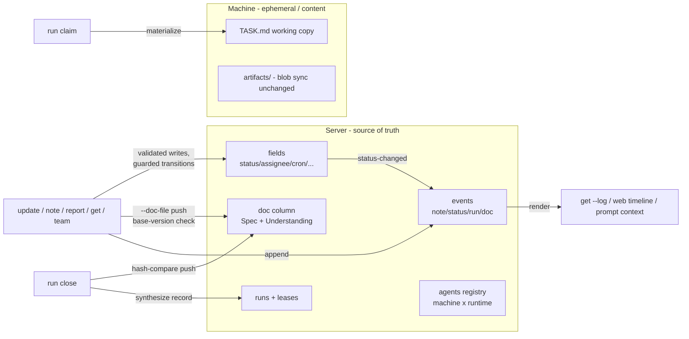

# Loopany v2 — Cloud-First Task & Loop State - Plan

## Goal Capsule

- **Objective:** Make the server the single source of truth for task/loop state. Work-state becomes validated fields, the README's `## Spec` + `## Current understanding` become one server-held doc edited through ephemeral working copies, and the Timeline becomes a typed event stream. The terminal grammar simplifies to "authority on transitions"; agents (machine×runtime) become the sole executor concept.
- **Authority hierarchy:** This plan > `packages/server/AGENTS.md` invariants > existing code patterns. Session-settled KTDs (labeled below) are closed decisions — do not re-litigate; surface invalidating evidence instead of silently deviating.
- **Stop conditions:** Stop and surface if (a) the migration splitter cannot cleanly process the mirror's real task files without data loss, (b) loop-execution compat with the published 0.16 daemon breaks (the live canary loop stops completing runs), or (c) any change requires weakening the content-fence (workflow/ui crossing machines).
- **Execution profile:** Create a new branch `feat/task-tree-v2` off `feat/task-tree` and work there — v1 stays intact on its own branch. Continuous commits, both test suites green per commit, live verification against the `:3100` mirror rig. Nothing merges to `main` as part of this plan.
- **Tail ownership:** The prose/prompt unit (U8) is deploy-coupled and lands last; it is part of this plan, not a follow-up.

---

## Product Contract

### Summary

Loopany today is file-first: a task's state, brief, memory, and timeline all live in a `README.md` on one machine, mirrored to the server. This plan inverts authority: the server owns state (fields), curated prose (one doc column), and history (events); local files remain only as ephemeral working copies and as artifact content. The CLI grammar collapses to three write primitives — `update` (fields + guarded transitions), `note` (immutable events), `report` (loop-run monitor returns only) — and executors become named agents instead of machine/runtime strings. Human-in-the-loop review and loop visibility ride the same system: reviewable outputs become child tasks referencing artifacts, and a loop's live state is its subtree plus events plus metrics.

### Problem Frame

The file-as-truth design made every cross-boundary feature hard: notes from another machine or the web are impossible, work-state writes are fenced to the folder's machine, cross-device assignment needs snapshot materialization, web editing needs an intent queue, and the agent-curated Timeline can silently compress away human notes. Three reference designs (an all-server task platform; an all-git-local design; a git-doc + server-index hybrid) triangulated the split adopted here: state and record belong server-side; long-form curated prose keeps file-editing ergonomics via working copies; artifact content stays local/git.

### Requirements

State plane:

- R1. Work-state (status, assignee, parent, priority, follow_up_date, type, refs) lives in server fields, written via `update k=v`, validated at write, team-writable — no file-locality restriction.
- R2. The task doc (`## Spec` + `## Current understanding`, one markdown body) is server-held and authoritative. It is edited only through working copies: auto-materialized as `TASK.md` at run claim and auto-pushed at run close; explicit `get --checkout` / `update --doc-file` in sessions, with base-version conflict detection (drift → 409 carrying the diff, never a silent clobber).
- R3. Each task has one append-only typed event stream (`note`, `status-changed`, `assignee-changed`, `doc-updated`, `run-started`, `run-returned`). The Timeline is a render of this stream, never an authored document.
- R4. `note <ref> "<text>"` appends an immutable comment event from any credential (device or run) and any machine, team-scoped.

Terminal grammar:

- R5. A task run (cron-null dispatch) ends by setting state and exiting; the daemon closes the run and the server synthesizes the run record from exit code, events emitted during the run, and cost. No terminal verb is required.
- R6. `report --status new|resolved|nothing-new` is valid only for runs of recurring nodes; a task run calling it receives a teaching error.
- R7. `update status=done` from a run credential on a recurring node is the guarded completion transition: requires the lease's `canFinish` capability, requires `--note` (the evidence, stored as the note on the `status-changed` event), is once-only (repeat → CONFLICT; goal cleared mid-run → refused), and atomically pauses the schedule, stamps `completedAt`, and fires the completion notification. Owner credentials complete without the guard. `finish` remains a hidden alias for this transition.

Executors:

- R8. Agents are the sole executor concept: auto-registered rows per (machine × detected runtime), auto-named, renamable, presence inherited from the machine. Devices disappear from assignment UX. The loops `agent` column is renamed conceptually to runtime; the create-envelope `agent` key is retired (accepted as an alias).
- R9. `team` lists `people[]` (membership emails/names) and `agents[]` (name, runtime, presence, home machine) — everything needed to fill either assignee form. `--json` supported.
- R10. `assignee` accepts a person (email) or an agent (name/slug); it is never auto-set by create or by any run. Own-devices rule and edge-dispatch semantics from the existing branch carry forward unchanged, re-addressed through agent names.

Human-in-the-loop and visibility:

- R11. A reviewable output is captured as a child task referencing its artifact (`refs`), assigned to a person; the inbox is `list --assignee <me>` plus due filters. Approving is `update status=done --note`. Artifacts without a lifecycle get no row.
- R12. `home` (and therefore the SessionStart hook) surfaces a `needs you[N]` line: the caller's assigned open tasks and arrived follow-ups.
- R13. `get <loop>` rolls up the loop's live state: children grouped by status, recent events, and metrics — the headless dashboard. The web kanban reads the same rows (render change only; no new web write surface).

Compatibility and boundaries:

- R14. A one-time migration splits every existing `task_file_content`: front matter → fields (already derived), Timeline lines → seeded events (best-effort parse), remainder → the doc. Unparseable content stays in the doc; bytes are never dropped. Rehearsed against the mirror's full loop set before being trusted.
- R15. Loop execution stays fully compatible with the published 0.16 daemon: claim, run, report, artifact sync all unchanged. An old daemon's task-file sync field is ignored gracefully. Task-tree features require the new daemon (clean break; task-tree never shipped).
- R16. Artifact content handling is unchanged: local files, watcher, blob pipeline, per-loop caps, retention.
- R17. The content-fence survives: `workflow`/`ui`/`stateSchema` writes remain machine-local; reads stay ≤ the owner's browser view.

### Scope Boundaries

- **Deferred to follow-up work:** custom/persona agents (registry rows beyond auto-registration, `instructions` riding delivery), loop→agentId FK re-keying, per-piece domain stage vocabulary (`scheduled`/`published` labels beyond the generic status enum), `loopany doc <ref>` $EDITOR sugar, session-as-run tracking (`session start`), threaded comments/projection, web write surfaces, CLI user login (device-code flow), cross-machine loop migration, `task_file_content` → `doc` column rename.
- **Outside this plan's identity:** replacing artifact storage with cloud documents (content stays local/git by decision), squads/routing layers, notification channel work beyond deriving notify-on-terminal-status.

### Success Criteria

- The full task lifecycle (create → assign → dispatch → doc edit in run → status transitions → events → completion) works with no permanent local README, verified live on the mirror rig.
- A note posted from a second machine (or via server API) appears in the task's log and in the next run's prompt context.
- The live canary loop ("IG permission warmer") continues completing runs on the published daemon throughout.
- Migration rehearsal on the mirror: every existing loop row splits with zero information loss (doc + seeded events + fields reproduce the original content's information).

---

## Planning Contract

### Key Technical Decisions

- KTD1. **Cloud-first authority.** Server rows are the source of truth for fields, doc, and events; local task files demote to ephemeral working copies. (session-settled: user-directed — chosen over file-first after comparing the three reference designs: the file plane was the complexity center — sync, fences, intent queues, materialization all existed only to serve it.)
- KTD2. **One doc column.** `## Spec` + `## Current understanding` stay one markdown body (reusing the existing `task_file_content` column; no rename mid-pivot). (session-settled: user-directed — chosen over a separate `understanding` field/KV: "feels complicated"; the working-copy pattern removes the RMW pressure that motivated the split.)
- KTD3. **Working-copy editing with optimistic concurrency.** Docs are edited via checkout → native file edit → push with base-version check; runs get this automatically (claim materializes `TASK.md`, close pushes it, the run lease serializes). (session-settled: user-directed — chosen over CLI whole-blob writes: preserve the agent's Edit-tool ergonomics for marginal edits; a write-once description field is the cautionary case.)
- KTD4. **Authority on transitions, not verbs.** One write verb (`update`); the server enforces per-transition rules keyed on credential × node kind. `finish` and `reason=` dissolve into the guarded done-transition with a mandatory note (R7). (session-settled: user-directed — chosen over separate finish/report-everywhere verbs across three exchanges: the run/task asymmetry was a file-era fossil, and a note attached to the transition event is the completion reason.)
- KTD5. **`report` scoped to monitors.** The new/resolved/nothing-new vocabulary answers "did anything change about the thing I watch" — meaningful only for recurring runs, where silence is ambiguous. Task runs auto-close (R5). (session-settled: user-directed — chosen over report-as-universal-terminal: for a finishing task, outcome ≡ the status transition.)
- KTD6. **Agents replace devices as the executor concept now**, as an addressing/identity layer over the existing `(machineId, runtime)` columns — no FK change yet. (session-settled: user-directed — "set agents concept directly and remove devices"; storage re-keying deferred until personas make re-homing real.)
- KTD7. **Synthesized run records for task runs.** The daemon closes a task run on process exit; the server derives the record from exit code + events + cost — the pattern already proven for degraded (codex/grok) agents. (session-settled: user-approved.)
- KTD8. **One-time migration, not lazy conversion.** All rows split at migration so exactly one code path stays alive. (session-settled: user-approved via scoping call-out; rule: anything unparseable remains in the doc, never dropped.)
- KTD9. **Clean break for task features / full compat for loop execution** on old daemons. (session-settled: user-approved via scoping call-out — task-tree never shipped, so the break costs nothing; the live loop fleet must not notice.)
- KTD10. **Review items are tasks; artifact state gets a row, artifact content stays bytes.** No parallel review/inbox system; no artifact-front-matter workflow state. (session-settled: user-approved — closes F7's notice+decide with existing machinery; the same three-plane split applied to artifacts.)
- KTD11. **Events are one flat typed stream per node** — notes, state changes, run boundaries share it; the UI timeline, CLI `--log`, and prompt context are three renders of the same rows. No threading. (session-settled: user-approved; thread/cursor machinery is the complexity this avoids.)

### High-Level Technical Design

Write paths in one line each: fields via `update` (transition guards server-side); doc via working copy push (lease-serialized in runs, base-checked in sessions); events append-only from chokepoints and `note`. The old upward path (watcher → `taskFileContent`) is removed for task files and retained for artifacts.

### Assumptions

- The events table at `(id, loop_id, type, actor, at, text, data)` with a `(loop_id, at)` index is sufficient for v1 read patterns (bounded `--since`/`--recent` per node); no cross-node event queries are needed yet.
- Timeline seeding tolerates the observed real-world formats (dated bullets in several shapes, Chinese content, attributed `(actor)` suffixes); lines that don't parse become one `note` event carrying the raw line.
- Daemon runtime detection can reuse the existing bin-resolution paths (`LOOPANY_CLAUDE_BIN`/`_CODEX_BIN`/`_GROK_BIN`) at daemon start; old daemons that never report `agents` degrade to "runtimes seen in this machine's loops".
- Notify-on-terminal-status for dispatched task runs can ride the existing notification path keyed off the synthesized run record (no new channel).

### Sequencing

U1 → U2 (independent of U3) → U3 → U4 → U5 → U6 → U7 → U8. U2 can land any time after U1. U8 is deploy-coupled and strictly last. Each unit: 1–2 commits, `pnpm -r typecheck` + both suites green, live check on the mirror rig where applicable.

---

## Implementation Units

### U1. Events table and the `note` verb

**Goal:** The append-only typed event stream exists, is emitted from every state chokepoint, and `note` works from any credential and machine.

**Requirements:** R3, R4.

**Dependencies:** none.

**Files:** `packages/server/src/db/schema.ts`, new migration, `packages/server/src/db/store.ts`, `packages/server/src/gateway/index.ts`, `packages/server/src/gateway/cli.ts`, `packages/daemon/src/route.ts`, `packages/daemon/src/tasks.ts`; tests in `packages/server/src/gateway/events.test.ts` (new), `packages/daemon/src/tasks.test.ts`.

**Approach:**
1. `events` table + `store.addEvent`/`listEvents(loopId, {since, limit})` (newest-anchored).
2. Emit from existing chokepoints: `updateLoop` field diffs → `status-changed`/`assignee-changed`; report finalize → `run-returned`; dispatch → `run-started`.
3. `note` verb: server handler for device + run credentials (team-scoped per R4, resolved via `ownerScopedLoops` — the AGENTS.md team-read invariant), daemon routing, `get --log [--since|--recent]` render with truncation hints.

**Patterns to follow:** flat-404 scoping via `ownerScopedLoops`; bounded anchored reads per the log-render conventions in `gateway/cli.ts`.

**Test scenarios:**
- Happy: `note` from the task's own machine and from a second same-owner machine both append attributed events; `get --log` renders newest-first with `--since` filtering.
- Chokepoints: a status change via `update` emits exactly one `status-changed` event with old→new; a run dispatch/report emits `run-started`/`run-returned`.
- Auth: a stranger's credential noting a non-scope task → flat 404; a run credential notes its own task successfully.
- Bounds: 60 events with `--recent 10` returns 10 + a truncation hint; `--since` past the newest returns empty, not an error.

**Verification:** suites green; live — `loopany-dev note <task> "hi"` from the rig appears in `get --log` and in the web task pane after refresh.

### U2. Agents registry and the `team` verb

**Goal:** Agents are addressable, listed, and used for assignment; devices leave the assignment UX.

**Requirements:** R8, R9, R10.

**Dependencies:** U1 (events attribute actors; agent rows give them names).

**Files:** `packages/server/src/db/schema.ts` (+migration: `agents` table, `machines.agents` column), `packages/server/src/gateway/index.ts` (poll ingestion, assignee resolution), `packages/server/src/gateway/cli.ts` (`team` render), `packages/daemon/src/daemon.ts` (runtime detection in poll body), `packages/daemon/src/route.ts`, `packages/daemon/src/help.ts`; tests in `packages/server/src/gateway/tasks-api.test.ts`, `packages/daemon/src/daemon.test.ts`.

**Approach:**
1. Daemon detects installed runtimes at start (existing bin-resolution seams) and reports `agents: [...]` in the poll body.
2. Server upserts one agent row per (machine, runtime), auto-named from machine name + runtime; renamable via `update` on the agent (or defer rename to the web — smallest viable: auto-names only).
3. `assignExecutor` resolves agent names/slugs (409 with candidates on ambiguity) in addition to the retiring `<machine>/<runtime>` form (kept as hidden alias).
4. `team`: `people[]` from memberships, `agents[]` with presence; `--json`.
5. Envelope `agent` key → accepted alias for `runtime`.

**Test scenarios:**
- Poll with `agents: ["claude-code","codex"]` upserts two rows; a second poll is idempotent; an old daemon (no field) falls back to loop-derived runtimes.
- `update <task> assignee=<agent-name>` re-binds and edge-dispatches exactly as the executor form did (reuse the existing dispatch tests re-addressed).
- Ambiguous agent name across two machines → 409 listing candidates with machines.
- `team` shows only the caller's memberships; a stranger's agents never appear.

**Verification:** live — `loopany-dev team` lists this machine's detected agents; assignment by agent name dispatches the one-shot run.

### U3. Doc authority: checkout/push, base-version, migration splitter

**Goal:** The doc column is authoritative and editable via working copies; existing content is split once into fields + events + doc.

**Requirements:** R2, R14.

**Dependencies:** U1 (Timeline seeds become events).

**Files:** `packages/server/src/gateway/index.ts` (doc push handler + base check), `packages/server/src/gateway/cli.ts`, `packages/daemon/src/tasks.ts` (`get --checkout`, `update --doc-file`), new `packages/server/scripts/migrate-v2-split.ts` (or migration-adjacent module), `packages/server/src/server/frontmatter.ts` (splitter reuse); tests: doc roundtrip/conflict in `tasks-api.test.ts`, splitter fixtures in a new `packages/server/src/server/docSplit.test.ts` fed by real mirror-shaped fixtures.

**Approach:**
1. Doc push: `update --doc-file` carries content + base hash; mismatch → 409 with a unified diff of server-vs-base; `doc-updated` event on success.
2. `get --checkout` writes `<slug>.md` + a sidecar base-hash file; the fence rules for file flags apply.
3. Splitter: front matter → drop (fields already derived in `taskMeta`), Timeline section → parsed lines as seeded `note` events (raw line preserved when unparseable), remainder → doc. Property: `bytes(doc) + bytes(seeded events) + fields ⊇ information(original)`; nothing silently dropped.
4. U3 builds and REHEARSES only (splitter, fixtures, mirror rehearsal script). The destructive all-rows migration does NOT run here — it executes in U6's final commit, after the task-file ingest paths are deleted, so no live watcher flush or report can overwrite a freshly split doc.

**Execution note:** Build the splitter test-first against fixtures copied from the mirror's real content shapes (no front matter at all; three Timeline formats; Chinese sections; the ops-manual-sized file) before wiring the migration.

**Test scenarios:**
- Roundtrip: checkout → edit → push succeeds and emits `doc-updated`; second push with a stale base → 409 whose body contains the diff.
- Splitter: each fixture class splits losslessly; a file that is one giant unstructured body → everything lands in doc, zero events, no error.
- Concurrency: push during an open run of the same task is refused or serialized (lease wins) — no interleaved clobber.

**Verification:** mirror rehearsal script output: N rows, 0 losses, seeded-event count; spot-check three real loops' rendered logs against their old Timelines.

### U4. Transition guards; `finish`/`report` rescope

**Goal:** One write verb with server-enforced per-transition rules; run credentials gain field writes; the guarded done-transition subsumes `finish`.

**Requirements:** R5 (grammar half), R6, R7; R17 unchanged.

**Dependencies:** U1 (events carry the completion note), U3 (status now field-only).

**Files:** `packages/server/src/gateway/index.ts` (`validateTransition`, editLoop changes), `packages/server/src/gateway/cli.ts` (run-credential update gains work-state; report gate; finish alias), `packages/daemon/src/tasks.ts` (drop file-era work-state rejections); tests in `tasks-api.test.ts`.

**Approach:**
1. Delete the run-credential work-state rejections (file-era routing, not security).
2. `validateTransition(credential, node, patch)`: the guarded case = run + recurring + `status=done` → require `canFinish`, require `--note`, once-only (CONFLICT on repeat), TOCTOU on goal, atomic bundle (pause schedule, `completedAt`, completion notification). Owner path unguarded (unchanged behavior).
3. `finish --reason` → silent alias emitting the same transition (`--reason` maps to the note).
4. `report` on a cron-null run → 400 teaching error naming the new grammar.

**Test scenarios:**
- Task run: `update status=done` from a run credential applies, emits events, no guard.
- Goal-loop run: bare `status=done` → 400 requiring a note; with note → completes atomically (schedule paused + completedAt + notification fired once); second attempt → CONFLICT; goal cleared mid-run → refused.
- Open-monitor run: `status=done` without `canFinish` → 403.
- `finish --reason "x"` ≡ the guarded transition (equivalence test); `report` on a task run → teaching 400; on a loop run unchanged.

**Verification:** existing loop-run flows (canary) unaffected; the prompt-level change waits for U8.

### U5. Run auto-close and `TASK.md` delivery

**Goal:** Task runs need no terminal verb; the doc travels with the run.

**Requirements:** R5, R2 (run half).

**Dependencies:** U3, U4.

**Files:** `packages/daemon/src/runner.ts` (materialize `TASK.md` at claim; close-on-exit; hash-compare push), `packages/server/src/gateway/index.ts` (close endpoint synthesizing the record from exit + events + cost; notify-on-terminal-status), `packages/server/src/gateway/delivery.ts`; tests in `packages/daemon/src/runner` tests + `tasks-api.test.ts`.

**Approach:**
1. Claim for a cron-null run delivers the doc; the daemon writes `TASK.md` into the run workdir.
2. On process exit with no terminal call: daemon posts close (exit code, cost, changed `TASK.md` if hash differs); server writes the run record derived from exit + events emitted during the run, retires the lease, notifies per policy when a terminal status change occurred.
3. Loop runs unchanged: `report`/guarded-done remain their terminal calls; auto-close acts as backstop only (sweep semantics untouched).

**Test scenarios:**
- Task run edits `TASK.md`, sets `status=done`, exits 0 → clean record (`done`), doc pushed, lease retired, one notification.
- Task run exits 0 with status still `todo` and no events → record marks the run complete-but-inconclusive; the task visibly remains todo; no notification.
- Nonzero exit → failed record; sweep/reclaim paths unaffected (regression).
- Doc unchanged → no push, no `doc-updated` event.

**Verification:** live — dispatch a real one-shot on the rig; confirm record, doc push, and notification without any `report` call.

### U6. `create` without scaffold; watcher demotion; deletions

**Goal:** Tasks are born in the cloud; the watcher serves artifacts only; the file-era machinery is removed.

**Requirements:** R1 (completion), R11 (attach mechanism), R15, R16.

**Dependencies:** U3, U5.

**Files:** `packages/daemon/src/tasks.ts` (create: no folder write; `--spec`/`--spec-file`), `packages/daemon/src/watcher.ts` (drop task-file duty), `packages/server/src/gateway/sync.ts` (ignore `taskFile` field gracefully — old-daemon tolerance), `packages/server/src/gateway/index.ts` (remove `ingestTaskFileContent` auto-pause path — now plain field validation; remove assignment snapshot-materialization), `packages/daemon/src/taskfile.ts` (retire scaffold/patch helpers), prompts untouched until U8; tests updated across both packages.

**Approach:**
1. `create` seeds the doc from `--spec`/`--spec-file` (fenced); the folder appears lazily only when artifacts are first written.
2. Watcher: artifact paths only; server ignores a v1 daemon's `taskFile` sync field (log once, no error).
3. Delete: `refreshTaskFileContent`, front-matter ingest invariants, cross-machine work-state errors, snapshot-materialization in `assignExecutor` (delivery now carries the doc per U5).
5. Execute the one-time migration (built and rehearsed in U3) in this unit's final commit — the ingest paths are gone, so nothing can race it (this ordering is load-bearing; see Open Questions).
4. Keep `refs` first-class on tasks and rendered in `get` (R11's attach mechanism).

**Test scenarios:**
- `create "x" --spec -` births a row with doc content and no folder; first artifact write creates the folder and syncs via blobs (existing pipeline test extended).
- Old-daemon sync POST carrying `taskFile` → 200, field ignored, one log line (tolerance regression).
- The deleted paths stay deleted: a grep-guard test asserting the removed symbols are gone (mirrors the repo's layout-test pattern).
- Artifacts pipeline untouched: existing sync/blob/retention suites pass unmodified.

**Verification:** live rig — full lifecycle with no README ever existing; canary loop still runs (R15).

### U7. Inbox surfacing: `needs you` + loop rollup

**Goal:** Attention and visibility are ambient and headless-native.

**Requirements:** R11, R12, R13.

**Dependencies:** U1, U2.

**Files:** `packages/server/src/gateway/cli.ts` (`homeDevice` needs-you line; `get` rollup: children-by-status + recent events + metrics), `packages/daemon/src/home.ts`; tests in `tasks-api.test.ts` + home render tests.

**Approach:**
1. `needs you[N]`: caller's open assigned tasks + arrived follow-ups, one line, capped with a hint.
2. `get <recurring-node>` gains the rollup block (children grouped by status with counts, top few per group, recent events, existing metrics line).
3. Prose for the review-as-child-task pattern is U8; this unit is the render surface.

**Test scenarios:**
- Home with two assigned-open tasks and one arrived follow-up → `needs you[3]` naming them; zero → line absent.
- `get` on a loop with children in three statuses renders grouped counts; done/archived children summarized, not enumerated.
- Needs-you respects assignee resolution from U2 (person email match).

**Verification:** live — SessionStart hook output shows the needs-you line in a fresh shell.

### U8. Prompts and prose (deploy-coupled, last)

**Goal:** Every agent-facing instruction teaches v2; nothing teaches the file era.

**Requirements:** all (teaching layer); R5–R7 grammar, R11 pattern.

**Dependencies:** U1–U7 complete.

**Files:** `packages/server/src/skill/run/exec-core.md`, `exec-task.md`, `edit.md`, `packages/server/src/skill/SKILL.md`, `references/create.md`, `references/update.md`, `references/run.md`, `references/evolve.md`, `bootstrap.md`, `packages/server/src/gateway/prompt.ts` (doc/events embedded context), `packages/daemon/src/help.ts`, `packages/server/AGENTS.md`, `docs/task-tree-plan.md` (v2 spec recorded); prose-pinning tests.

**Approach:** Rewrite the run prompts around: doc as delivered context + `TASK.md` working copy discipline, events context (`--since` claim), terminal grammar per context, review-as-child-task with `refs`, the artifact rule ("state gets a row; bytes stay files"), agents as assignees. Keep `report`'s monitor framing; remove all README-as-memory language. Record the deferred doors (Scope Boundaries above) in `docs/task-tree-plan.md`.

**Test scenarios:** prose-pinning tests updated (prompt phrases, bootstrap verbs, skill-references serving); `sync-skill` whitelist guard still green (internal prompts never ship in the tarball).

**Verification:** a fresh dispatched run on the rig follows the new discipline end-to-end without contradictory instructions.

---

## Open Questions

Deferred, non-blocking — resolve each at the named unit; none changes product scope. From the document review (headless):

- **R8 rename (decision, U2):** the contract says agents are renamable; U2 hedges. Default to rename-via-`update`-on-the-agent unless the owner says defer (then amend R8 + Scope Boundaries). The defer-to-web branch is invalid (web writes are deferred).
- **U1:** events table gains a nullable `run_id` stamped by run-credential chokepoints (U5's record synthesis selects by it). Note text clips at the existing MESSAGE_CAP/WIRE_TEXT_CAP budgets; event retention is a named deferred door.
- **U1/U7 (web render half):** the web task pane's timeline re-points at the event stream (U1) and the kanban's row source at the task rows (U7) — render-only; without this, U1's web verification is unsatisfiable and R13's web half untraceable.
- **U2:** poll-reported `agents` validated via `coerceCodingAgent`, unknown values dropped, list capped.
- **U3:** front matter is NOT blanket-dropped — parse, subtract keys the derived fields fully represent, carry any remainder (unknown keys, invalid enums, over-cap blocks) into the doc verbatim. Migration is per-row transactional with a migrated marker (idempotent re-run) and retains original bytes until the verification gate passes. Pre-migration drain gate: flag rows whose `taskFileSyncedAt` is stale relative to machine presence or whose content sits at the ingress clip cap.
- **U3/U5 (doc concurrency):** commit to REFUSAL — a non-lease doc push while a run lease is active → 409 naming the run; the run's close push is the sole writer in the lease window.
- **U4:** the once-only completion check is a conditional write on `completedAt` null at the `store.updateLoop` chokepoint; the notification fires only on the winning write. Keep a regression test that the content-key fence survives the rejection-deletion commit.
- **U5:** the close endpoint authenticates via the run lease with report's exact semantics — terminal-grace honors one reconciling close (the laptop-sleep wake case), a retired/canceled lease's close is ignored before any loop-level write, and a stale close never overwrites a doc updated after reclaim. Add the sleep/wake test.
- **U6 (old-daemon compat):** do not silently ignore a 0.16 daemon's task-file sync/report content — route it through the splitter as a legacy doc write (Timeline lines → events, remainder → doc), so existing loops' README steering and memory keep working. Extend the canary gate to assert the loop's doc/events ADVANCE after a run, not just that runs complete, and run that gate through U8.
- **U6 RESOLVED (migration semantics, implementation decision):** the executed migration is CONSERVATIVE — it seeds historical dated Timeline entries as events (deduped on day+text, the same rule the live ingest chokepoint applies on every sync/report), and leaves the doc byte-identical. The destructive doc rewrite was dropped: the fields plane still derives from the doc's front matter at the store chokepoint, so subtracting front matter would erase work-state, and a doc-preserving seed is idempotent and race-free against a live watcher flush (re-run = no-op, verified on the mirror: 416 events / 80 rows, second run 0). The doc's front-matter block is accepted as the field plane's serialization until a later decoupling unit; the ingest paths therefore STAY (they are the legacy advance mechanism), which also dissolves the original migration/ingest race.
- **U8:** delivered prompts degrade by daemon capability (pre-v2 daemons get the doc inlined read-only, no TASK.md/working-copy instructions). Embedded events and the delivered doc are wrapped in an explicit untrusted-data fence in `prompt.ts`, prose-pinned.
- **R2 (state in the doc-push handler):** doc pushes are team-writable like R1 fields, scope-gated via the owner-membership resolution; the 409 diff body is gated by the same check.
- **R5 (one sentence):** a terminal status change during a task run fires the standard notification, derived from the synthesized run record.
- **Success criteria:** add a fifth criterion demonstrating the review flow end-to-end (run → child task → assignee's `needs you` → approve via `update status=done --note` → event recorded), live on the rig.

### AXI conformance (audit 2026-07-24, applies across units)

The CLI follows the AXI standard (kunchenguid/axi SKILL.md); the server verbs already conform via the TOON spine. The v2 units close the task-verb drift:

- **Task verbs join the text-sink architecture (U1/U7):** `list`/`get`/`search`/`note` route through the unified `/api/machine/cli` dispatch and render server-side TOON (tabular headers with counts), like every other verb — one render authority for CLI/web/prompt. Client-side rendering in `tasks.ts` retires.
- **Fail loud on unknown flags (U1):** each task verb validates its own flag set before any call; unknown flag → exit 2 with the valid flags inline (self-correcting in one turn). `parseArgs`'s silent-ignore behavior is a defect, not a feature.
- **Errors on stdout, exit-code discipline (U1):** task-verb errors emit the structured `error:`/`code:` shape on STDOUT; exit 2 = usage only; NOT_FOUND/CONFLICT = exit 1 (matching the log/show convention).
- **`get` truncates the doc (U7):** ~1000-char preview + `(truncated, N chars total)` + `--full` escape hatch; `--json` stays complete.
- **`list` slims + gains `--fields` (U7):** default columns id/title/status plus the ⟳/⏰/@machine markers; everything else opt-in.
- **Aggregates + empty states (U1/U7):** `--log` carries `count: N of M`; empty logs/lists state the zero definitively.
- **Contextual disclosure (U7/U8):** mutation responses (`create`/`update`/`note`) carry 1-2 parameterized `help[]` next steps; detail views omit them (self-contained).
- **Documented deviations:** run-credential completion repeat stays CONFLICT/exit 1 (a lying no-op would misreport an unrecorded claim; owner-path no-op IS conformant); `report` stays mandatory for loop runs.
- **Deferred doors:** OpenCode session-hook target; SKILL.md generated from the home view with a CI staleness check.

## Verification Contract

- Per commit: `pnpm -r typecheck`; `pnpm --filter @loopany/server test` (use `--maxWorkers 4` locally — full parallelism starves pglite on this machine); `pnpm --filter @crewlet/loopany test`. Known pre-existing failure to ignore: `loopDetailCrossTeam.test.ts` (sandbox temp-dir EACCES).
- Migration gate (U3): rehearsal against the Docker mirror (`postgres://…:5433/loopany`, 115 real loops) must report zero information loss before the migration is considered valid.
- Live gates: the `:3100` rig + `loopany-dev` shim for each unit's live check; the canary loop ("IG permission warmer", daily 23:00 UTC) must keep completing runs on the published daemon through U8 (R15), and from U6 its doc/events must ADVANCE after each run, not merely complete.
- Grammar gates: `report` teaching-error on task runs; guarded-done equivalence with `finish`; note-from-second-machine.

## Definition of Done

- All eight units landed as green commits on `feat/task-tree`; no merge to `main` under this plan.
- R1–R17 each traceable to landed behavior; the four success criteria demonstrated on the rig.
- No dead file-era code: the U6 deletion list is gone, and no prompt/prose references README-as-truth.
- Deferred doors recorded in `docs/task-tree-plan.md`; `packages/server/AGENTS.md` updated with the v2 invariants (doc authority, transition guards, events, agents layer).
- Abandoned experiments and scratch code removed from the branch diff.
