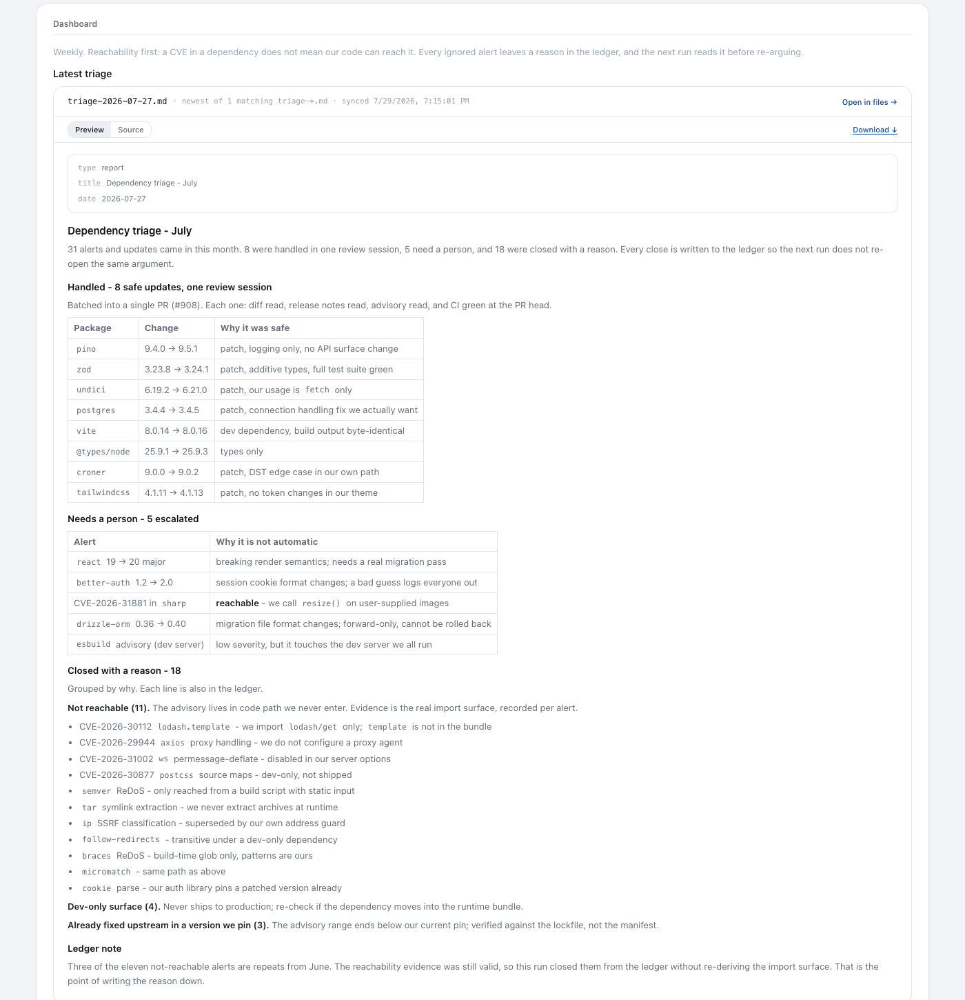

Last month, Dependency Triage picked up 31 alerts and updates. Eight were safe enough to handle in one review, 5 came to me, and we closed the other 18 with a reason attached.

First question: can our code even reach it? A CVE can sit in a dependency without touching a path we ship. Most of the scary alerts fell away at the real import surface, and the loop kept the evidence.

Patch updates only make the review batch after we've read the actual diff and release notes, checked the advisory, and seen CI pass on that PR head. Major changes wait. So do breaking or security-sensitive ones.

Whenever we ignore an alert, the reason goes into the ledger. Next week's run doesn't start the old argument again. Out of 31 items, I only had to decide on 5. The other 26 already had an answer attached.
