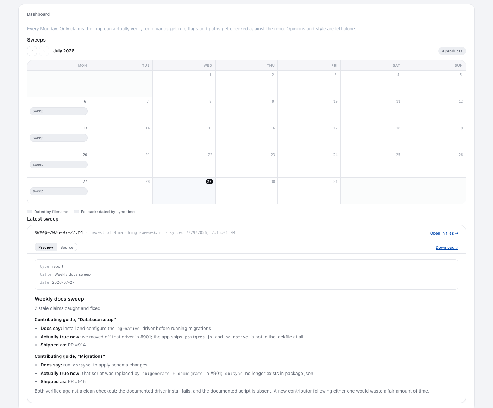

This month, Docs Sweep caught two stale claims. Our contributing guide still named a database driver we'd stopped using, and it described a migration flow we'd already replaced. Either one could send a new contributor down a pretty long detour.

On Mondays, the loop checks the claims it can actually prove. Commands get run. It checks flags and paths against the repo, along with environment variables and versions. Opinions and tone aren't part of the job.

When the docs have drifted, it opens a small PR showing what they say and what's true now. We've shipped 6 of those in the last two months. Median review was under a minute. Good docs still rot. The weekly check keeps them honest.
