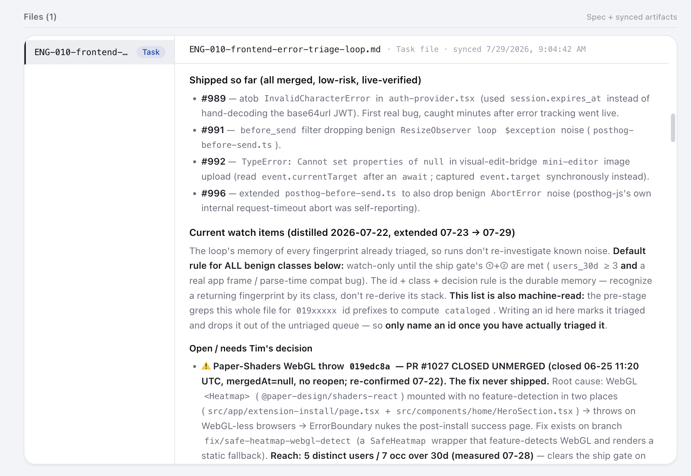

That morning's report looked like two regressions. Error Sweep pulled the traces and sessions, then found the one thing behind both: Safari 16.1 couldn't parse a new regex. 16 occurrences, 3 real users, modern browsers clean.

Instead of another dashboard, I got one question. Should we transpile the syntax and keep supporting the old browser, or make Safari 16.4 the floor? I answered once and we were done.

That's why I read this report. It follows noisy errors back to the boundary they share, then checks the counts against actual users and sessions. By the time it reaches me, I can merge a fix or answer a question. The investigation's already done.
