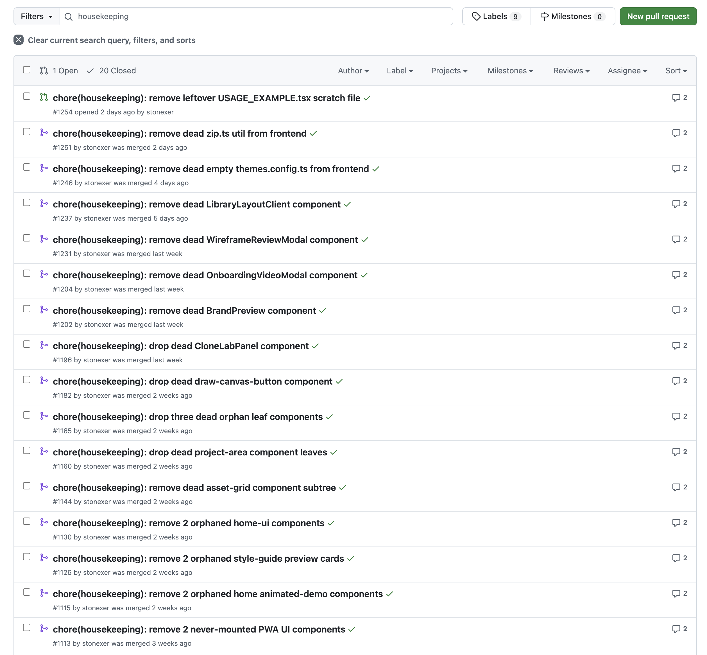

Housekeeper takes a pass through the codebase every morning at 7am. I leave unused imports to the linter. This thing looks for code that feels off, like building the same idea twice. It'll also notice when patterns have drifted across the repo. Sometimes it lands on a structure nobody can explain anymore.

Once it has a case, it picks one cleanup and opens the smallest PR it can. That's been 21 cleanups in 8 weeks, 20 of them already merged. None would've made it into a sprint. The repo just argues with itself a little less now.

One hard rule: don't change runtime behavior. If the loop isn't sure, it leaves a note and moves on. The win is catching places where the codebase has stopped making sense, before we build more on top of them.
