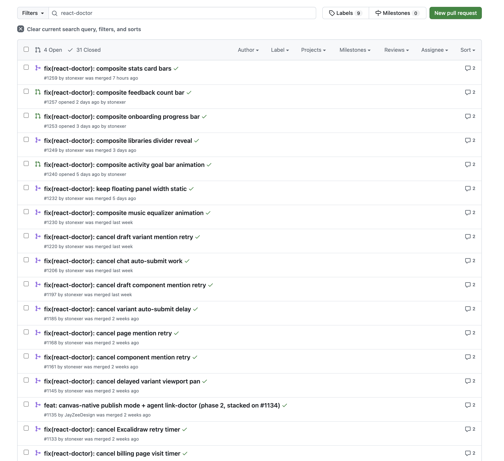

Over the last 3 months, React Doctor opened 35 fix PRs against our production app. Missing JSX keys, a locale-sensitive month bug, an impure state updater, unlabeled form controls. 31 are merged and 4 are still open. Most took me less than a minute to review. A few needed three to five.

Keeping each PR to one kind of defect made this work. I can review one of those over coffee. Spread the same work across 40 files under "lint fixes" and it'll sit there, even when the patch is right. Small PRs move.

For now, I'm still clicking merge. If it keeps sending clean diffs, we'll give it more room. It can earn that.

The loop runs at 6am, so the PR's waiting when I wake up. At 2pm it would be an interruption. In the morning it feels like the codebase tidied itself up.
