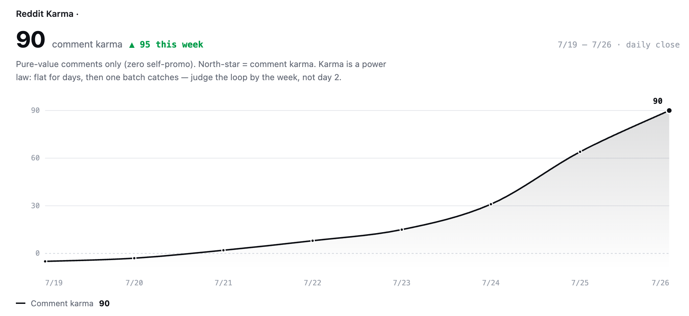
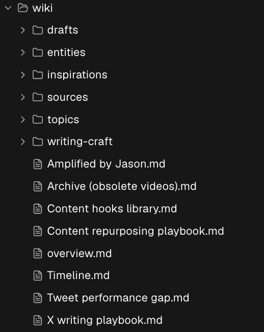
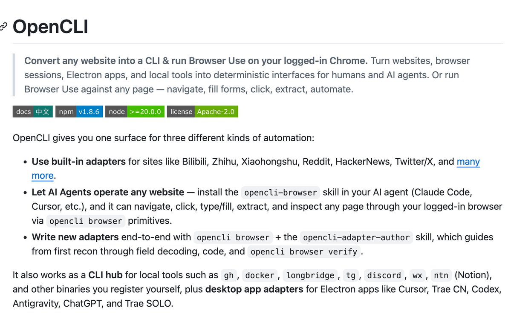
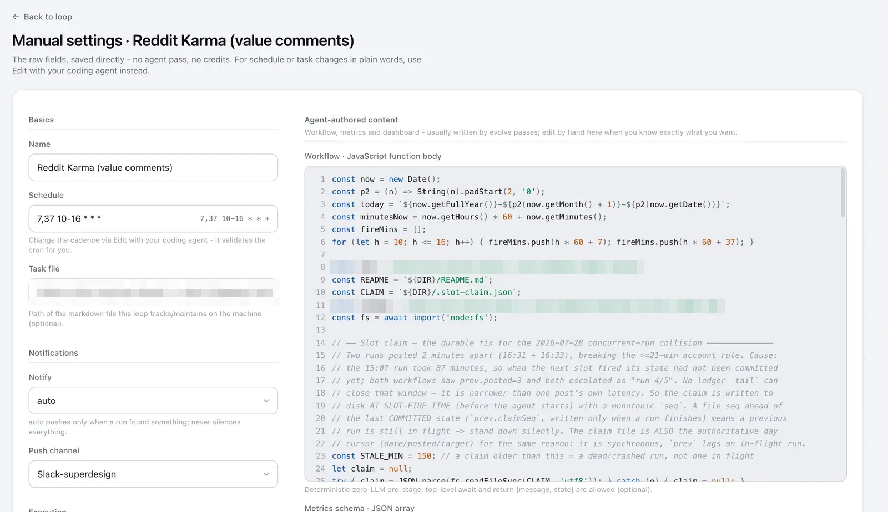

Over the last 7 days my Reddit account karma grew from -4 to 92 comment karma. This was done by my Reddit Karma loop.

I actually tried to run loops with Reddit before but it all failed, but this time I found the right leverage to make it work:

- Personal wiki to make content unique and good
- Thread filtering is key
- Right reddit tools for agent
- Randomness via right loop trigger
- Reflect & evolve

I will break it down for ya.

## The loop setup

The loop posts 3 to 4 comments on a typical day and skips the rest. The engine is a wiki built from my own content (more on how below). A scheduled job fires on half-hour slots across my daytime, and a workflow escalates only a few random slots to a real run.

Each real run:

1. Verifies the Reddit session.
2. Picks an expertise angle from the wiki.
3. Sweeps fresh threads in subs where that expertise fits, sorted by new, looking for a live pain point. "How do I", "why does this keep happening", "what's your workflow" questions.
4. Runs a quality gate: thread under 48h old, room temperature OK, and we have a concrete, non-generic answer grounded in a wiki fact.
5. Writes ONE comment. 2 to 6 sentences, answers the actual question, no preamble, no links, no product mentions.
6. Logs everything: what it posted, what it skipped, and why.

## Leverage #1: Wiki

The loop doesn't start with Reddit. It starts with a wiki. This makes a big difference in terms of result. Raw models give generic answers, the only way to make it unique is curated inputs.

My wiki includes all my past videos, articles and the resources I was interested in, organized into one page per topic I keep coming back to. One standing rule makes this work:

> The agent can only cite a position I have DOCUMENTED. It reads the page. It never reconstructs my opinion from memory.

This is the difference between an agent that sounds like me and an agent that sounds like ChatGPT doing an impression of a helpful developer. Generic AI answers are why automated comments usually read as slop. Mine come from one specific thing I actually hit, because the wiki page records the specific thing I actually hit.

## Leverage #2: Thread filtering is key

I assumed the hard part would be finding threads. It's the opposite. Fresh threads are everywhere. The filter is everything:

Discovery: per-sub newest feeds, not global search. Reddit's site-wide search returns old high-karma noise, useless for finding someone stuck right now.

And test your feeds: one sub we swept served months-old posts in its "new" feed. We dropped it.

The gate:

- under 48h old,
- room temperature OK (skip hostile pile-ons),
- a concrete answer grounded in a documented position.

The killer test: does someone else's reply already occupy my angle?

If a thread has one solid answer, the loop either adds a genuinely DISTINCT grounded angle or walks away. This test kills more candidate threads than every other rule combined.

On a typical day the loop reads dozens of threads and posts 3 or 4 comments.

The skipping is the strategy.

## Leverage #3: Right reddit tools for agent

Reddit has strict bot prevention.

Our loop posts through OpenCLI, which reuses my browser's logged-in Reddit session. No Reddit API app, no tokens, no separate bot account. The agent searches, reads threads and comments through one CLI, as me, from my machine.

That's also what makes it safe to wire a loop to it. Before doing anything, the run verifies who's logged in, and if the answer is wrong it stops completely rather than half-posting. Every action goes through the same session a human would use, at a human pace, under the account-level ledger and caps above. The goal isn't to hide automation. It's to make the automation behave the way a careful human would.

## Leverage #4: Randomness via right loop trigger

A bot that posts at exactly 9:00 every morning is announcing itself. Humans don't run on cron. We drift in at odd minutes, answer two threads before lunch, then vanish for an afternoon.

The problem: schedulers only know fixed times. There is no "post at random times" primitive in any scheduler I know.

So we built a workflow trigger feature in loopany, so  a loop can run a small deterministic workflow - The cron fires every half hour across my daytime, about 14 slots a day. On each tick the workflow reads the shared account ledger, checks the 21 minute gap and the daily cap, and then rolls the dice. Only a few slots win the roll and escalate into a real agent run. Every other tick dies right there as one silent log line.

Two things fall out of this.

First, the account behaves like a person. 3 to 5 comments a day, at times nobody could predict, naturally spaced because the ledger gap rides along on every roll. No comment lands at :00 on the dot two days in a row.

Second, it costs almost nothing. The expensive part of an agent loop is the agent. Here the model only wakes on the slots that won the roll. A skipped slot never touches an LLM.

The pattern generalizes way beyond Reddit: a fixed cron for reliability, a cheap deterministic pre-stage for randomness and guardrails, and the agent only when the pre-stage says go.

## Leverage #5: Self-Reflect & Evolve

Every Sunday the loop stops hunting and grades itself instead. It re-fetches every comment it posted that week, records the real score each one earned, and computes the week's karma delta. Then it tallies by subreddit and by topic angle: which subs actually earn upvotes, which angles land, which get ignored.

Then it rewrites its own strategy notes from the data. Not vibes, data. Subs that never convert get retired. Angles that got ignored get dropped or sharpened. And the winners get doubled: next week the loop deliberately shifts its slots toward the subs and angles that earned upvotes last week. Its next week looks different from its last week, and that's the point.

That's the loop-engineering pattern I keep coming back to: act, record, measure against the real system, adjust. An agent that posts is a toy. An agent that checks whether its posts worked and changes what it does next week is a system.
